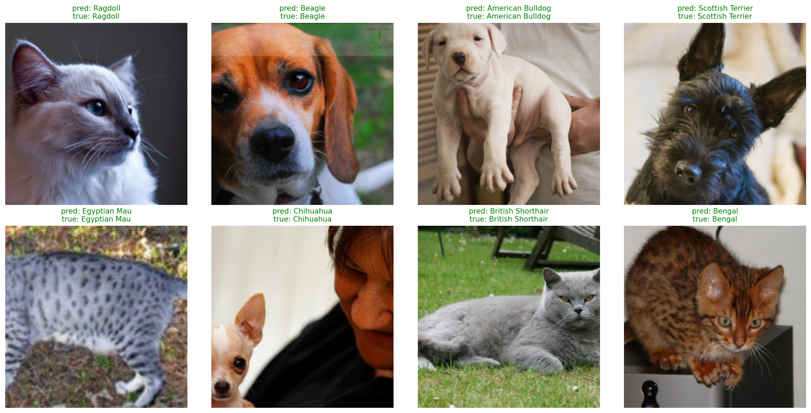

# Pet Breed Classifier — Transfer Learning with ResNet18

[](https://colab.research.google.com/github/joannapeniket/pet-classifier/blob/main/pet_classifier.ipynb)

Fine-grained classification of the 37 cat and dog breeds in the Oxford-IIIT Pet
dataset, using an ImageNet-pretrained ResNet18 as a frozen feature extractor
with a linear classification head trained on top. Runs end to end on a free
Colab T4 GPU in under ten minutes.



## Results

| | |
|---|---|
| **Test accuracy (frozen backbone)** | **87.9%** |
| Test accuracy (after fine-tuning `layer4`) | 88.2% |
| Trainable parameters | 18,981 of 11,195,493 (0.17%) |
| Random-guess baseline | 2.7% |
| Training time | ~7 minutes on a Colab T4 |

## Approach

The classifier is a standard transfer-learning setup:

- **Backbone** — ResNet18 with ImageNet-pretrained weights, entirely frozen.
  Every parameter has `requires_grad = False`, and the optimiser is given only
  the head's parameters, so the pretrained features cannot be modified.
- **Head** — the original 1000-class ImageNet layer is replaced with a single
  `Linear(512, 37)` trained from scratch.
- **Data** — Oxford-IIIT Pet ships only `trainval` and `test` splits, so the
  validation set is carved out of `trainval` with a seeded 85/15 index
  permutation. The test split is untouched until final evaluation.
- **Augmentation** — random resized crop and horizontal flip on the training
  split only; validation and test use a deterministic resize and centre crop so
  reported accuracy reflects the model rather than the luck of a random crop.
- **Normalisation** — ImageNet channel statistics, as required by the
  pretrained backbone.
- **Training** — Adam at `lr=1e-3`, cross-entropy loss, 10 epochs.

## Representation analysis

Beyond the headline accuracy, the notebook asks how much of that accuracy came
from the pretrained representation itself rather than from the trained head.

A **nearest-centroid classifier** provides the comparison: each breed is
represented by the mean embedding of its training images, and test images are
assigned to the closest centroid. It has no learned parameters at all.

| Method | Test accuracy |
|---|---|
| Nearest centroid, cosine | 87.0% |
| Nearest centroid, Euclidean | 86.6% |
| Trained linear head | 87.9% |

The gap is small: the frozen ResNet18 backbone already separates most breeds cleanly by itself, and the trained head adds only a modest 0.9 percentage points over simply picking the nearest breed centroid. Most of this model's accuracy comes from the pretrained representation, not from anything learned specifically for pets.

Cross-referencing the confusion matrix against centroid geometry gives a
correlation of **+0.41** between how often two breeds are confused and how close
their class centroids sit in embedding space — a moderate positive relationship.
Breeds with similar centroids are more likely to be confused, but plenty of the
variance comes from something else (pose, lighting, individual animals) that pure
centroid distance doesn't capture.

The most-confused pairs are exactly what you'd expect from breed standards, not model weakness: American Pit Bull Terrier, American Bulldog and Staffordshire Bull Terrier are all muscular, short-coated breeds that are notoriously difficult to tell apart even for experienced owners; Birman and Ragdoll are both long-haired pointed cat breeds; Egyptian Mau and Bengal are both spotted shorthairs. The model's errors track real visual similarity between breeds, not random noise.

## Repository structure

```
pet-classifier/
├── README.md
├── requirements.txt
├── pet_classifier.ipynb     # data, model, training, evaluation, analysis
└── predictions.png          # sample test predictions
```

## Running it

The notebook is written for Google Colab and needs no local setup:

1. Open `pet_classifier.ipynb` in Colab (badge above).
2. `Runtime → Change runtime type → T4 GPU`.
3. `Runtime → Run all`. The dataset (~800 MB) downloads on first run.

To run locally instead, `pip install -r requirements.txt` and run the notebook
in Jupyter. A CUDA-capable GPU is optional — the notebook falls back to CPU,
but training will be considerably slower.

## Notes and possible extensions

- Only `layer4` is unfrozen during fine-tuning, at a learning rate an order of
  magnitude below the head's. Earlier layers encode generic edge and texture
  detectors that need no adaptation, and are the most fragile to disturb.
- Model selection is done on the validation split; the test split is read once,
  at the end.
- Further directions: SVD of the embedding matrix to measure its effective rank,
  a random-projection sweep to see how far the 512-d features can be compressed
  before accuracy degrades, and comparing backbones of different depths.

## References

- Parkhi, Vedaldi, Zisserman and Jawahar. *Cats and Dogs*. CVPR 2012. —
  [Oxford-IIIT Pet dataset](https://www.robots.ox.ac.uk/~vgg/data/pets/)
- He, Zhang, Ren and Sun. *Deep Residual Learning for Image Recognition*. CVPR
  2016. — [arXiv:1512.03385](https://arxiv.org/abs/1512.03385)
- Snell, Swersky and Zemel. *Prototypical Networks for Few-shot Learning*.
  NeurIPS 2017. — [arXiv:1703.05175](https://arxiv.org/abs/1703.05175)
